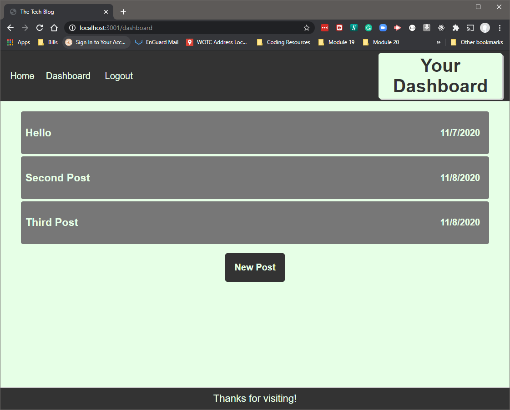

# Tech Blog


  

 
 
 
  
 
 
 


 ## Table of Contents:  

[1. Description](#Description)  
[2. Acceptance Criteria](#Acceptance-Criteria)  
[3. Screen Shots](#Screen_Shots)  
[4. Installation](#Installation)  
[5. License Details](#License-Details)  
[6. Submission](#Submission)   
[7. Questions](#Questions)  

## Description:  

As a full stack web developer who writes about tech, this is a CMS-style blog site where I can publish articles, blog posts, and my thoughts and opinions about tech and the tech industry.

## Acceptance Criteria  
1. When visiting the site for the first time a user is presented with the homepage, which includes existing blog posts if any have been posted; navigation links for the homepage and the dashboard; and the option to log in  
2. When a user clicks on the homepage option, they are taken to the homepage.  
3. When a user clicks on any other links in the navigation then they are prompted to either sign up or sign in  
4. When a user chooses to sign up, they are prompted to create a username and password  
5. When a user clicka on the sign-up button then the users credentials are saved and they are logged into the site  
6. When a user revisit the site at a later time and chooses to sign in, they are prompted to enter their username and password  
7. When a user is signed in to the site then they see navigation links for the homepage, the dashboard, and the option to log out  
8. When a user clicks on the homepage option in the navigation then they are taken to the homepage and presented with existing blog posts that include the post title and the date created  
9. When a user clicks on an existing blog post, they are presented with the post title, contents, post creator’s username, and date created for that post and have the option to leave a comment  
10. When a user enters a comment and clicks on the submit button while signed in, the comment is saved and the post is updated to display the comment, the comment creator’s username, and the date created  
11. When a user clicks on the dashboard option in the navigation they are taken to the dashboard and presented with any blog posts they have already created and the option to add a new blog post  

12. When a user clicks on the button to add a new blog post then they are prompted to enter both a title and contents for their blog post  
13. When a user clicks on the button to create a new blog post then the title and contents of their post are saved and they are taken back to an updated dashboard with their new blog post.  
14. When a user clicks on one of my existing posts in the dashboard they they are able to delete or update their post and are taken back to an updated dashboard  
15. When a user clicks on the logout option in the navigation they are signed out of the site  
16. When a user is  idle on the page for more than a set time then they are automatically signed out of the site 


## Screen Shots
  


## Installation - To Run Locally
1. Download the repo from the link below  
2. open a terminal window  
3. Run the following at the command line
```
    $ npm install
```
4. Start the server
```
    $ npm start
```
5. open your browser to localhost:3001 to view the site


## License Details  
This project is under no license

## Submission  
[MVC-TechBlog repository](https://github.com/civ187/MVC_TechBlog)  
[Heroku Deployment](https://vcltechblog.herokuapp.com)  

## Questions:  
 Here is a link to my github:  
https://github.com/civ187  
 Email me at:  
civ187@gmail.com  
for additional questions